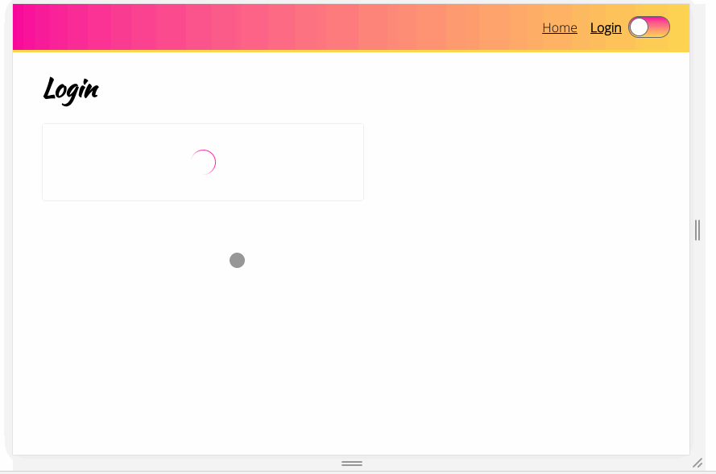

## StyledComponents Project

### Tools used:

1) Adding global styles using createGlobalStyle
2) Conditional styles based on props
3) Bulk styles using the "css" helper
4) Extending component styles
5) Styles based on routes
6) Media queries
7) Themes and variables
8) Referencing a styled component within another styled component
9) Interpolating functions to clean up style logic
10) Using PropTypes

### Installation and setup:

1) Clone repo
2) `npm install`
3) `npm start`
